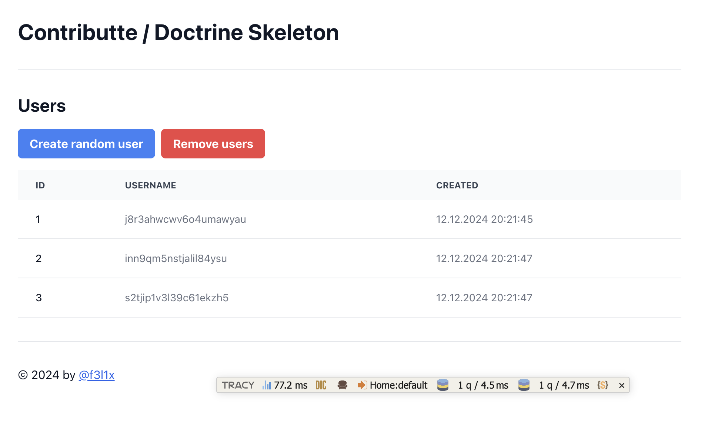

<p align=center>
  <a href="https://github.com/contributte/doctrine-skeleton/actions"></a>
  <a href="https://coveralls.io/r/contributte/doctrine-skeleton"></a>
  <a href="https://packagist.org/packages/contributte/doctrine-skeleton"></a>
  <a href="https://packagist.org/packages/contributte/doctrine-skeleton"></a>
</p>
<p align=center>
  <a href="https://packagist.org/packages/contributte/doctrine-skeleton"></a>
  <a href="https://github.com/contributte/doctrine-skeleton"></a>
  <a href="https://bit.ly/ctteg"></a>
  <a href="https://bit.ly/cttfo"></a>
  <a href="https://contributte.org/partners.html"></a>
</p>

<p align=center>
Website 🚀 <a href="https://contributte.org">contributte.org</a> | Contact 👨🏻‍💻 <a href="https://f3l1x.io">f3l1x.io</a> | Twitter 🐦 <a href="https://twitter.com/contributte">@contributte</a>
</p>

<p align=center>
	<a href="https://examples.contributte.org/doctrine-skeleton/">examples.contributte.org/doctrine-skeleton/</a>
</p>

<p align=center>
	
</p>

-----

## Introduction

This is a simple application with basic setup of [Doctrine](https://www.doctrine-project.org/) and [Nette](https://nette.org/).

To test this application, follow these steps:

1. Create a new project.
2. Install dependencies.
3. Setup configuration.
4. Run the application.

## Installation

You will need `PHP 8.4+` and [Composer](https://getcomposer.org/) and [Git](https://git-scm.com/) installed.

Install this application using **Composer** or **Git**.

**Composer**

Create project using composer.

```bash
composer create-project -s dev contributte/doctrine-skeleton acme
```

**Git**

```bash
git clone git@github.com:contributte/doctrine-skeleton.git acme
```

Now you have application installed. It's time to install dependencies.

```bash
cd acme
composer install
```

## Configuration

This application uses 2 databases PostgreSQL and MariaDB. You have to configure them in `local.neon`.
This is how default configuration looks like.

```neon
parameters:
	postgres:
		driver: pdo_pgsql
		host: 0.0.0.0
		port: 5432
		user: contributte
		password: contributte
		dbname: demopostgres
	mariadb:
		driver: mysqli
		host: 0.0.0.0
		port: 3306
		user: contributte
		password: contributte
		dbname: demomariadb
```

## Development

The easiest way is to use php built-in web server.

```bash
# make dev
php -S 0.0.0.0:8080 -t www
```

Then visit [http://localhost:8080](http://localhost:8080) in your browser.

## Usage

To setup this application properly, you have to execute migrations.

1. For **PostgreSQL** database.

```bash
# run migrations
NETTE__MIGRATION__DB=postgres NETTE__MIGRATION__MANAGER=default bin/console migrations:migrate

# or generate new migration
#NETTE__MIGRATION__DB=postgres NETTE__MIGRATION__MANAGER=default bin/console migrations:diff
```

2. For **MariaDB** database.

```bash
# run migrations
NETTE__MIGRATION__DB=mariadb NETTE__MIGRATION__MANAGER=second bin/console migrations:migrate

# or generate new migration
#NETTE__MIGRATION__DB=mariadb NETTE__MIGRATION__MANAGER=second bin/console migrations:diff
```

## Screenshots



## Maintenance

See [how to contribute](https://contributte.org/contributing.html) to this package.

This package is currently maintaining by these authors.

<a href="https://github.com/f3l1x">
    
</a>

-----

Consider to [support](https://contributte.org/partners.html) **contributte** development team.
Also thank you for using this project.
