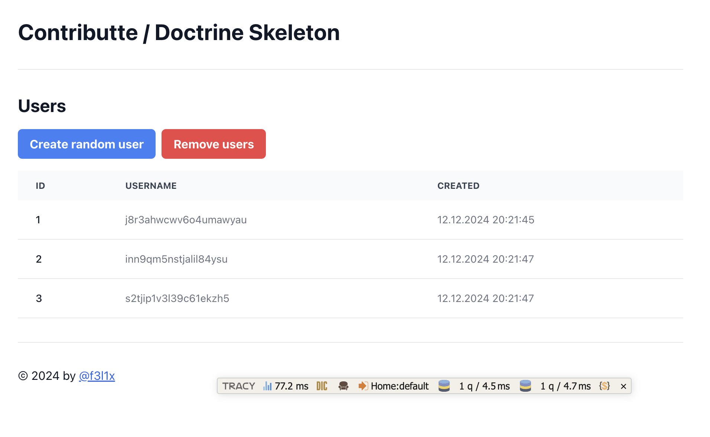

<p align=center>
  <a href="https://github.com/contributte/doctrine-skeleton/actions"></a>
  <a href="https://codecov.io/gh/contributte/doctrine-skeleton"></a>
  <a href="https://packagist.org/packages/contributte/doctrine-skeleton"></a>
  <a href="https://packagist.org/packages/contributte/doctrine-skeleton"></a>
</p>
<p align=center>
  <a href="https://packagist.org/packages/contributte/doctrine-skeleton"></a>
  <a href="https://github.com/contributte/doctrine-skeleton"></a>
  <a href="https://bit.ly/ctteg"></a>
  <a href="https://bit.ly/cttfo"></a>
  <a href="https://contributte.org/partners.html"></a>
</p>

<p align=center>
Website 🚀 <a href="https://contributte.org">contributte.org</a> | Contact 👨🏻‍💻 <a href="https://f3l1x.io">f3l1x.io</a> | Twitter 🐦 <a href="https://twitter.com/contributte">@contributte</a>
</p>

<p align=center>
  
</p>

Doctrine Skeleton is a Nette Framework starter project with Doctrine ORM on two databases, PostgreSQL and MariaDB.

-----

## Goal

Doctrine Skeleton shows how [Doctrine](https://www.doctrine-project.org/) ORM, DBAL and migrations work in a
[Nette](https://nette.org/) application with two connections and two entity managers. One `User` entity is mapped
in both, and the home page lists users from both databases, so you see the whole setup working before you change it.

It is built on:

- PHP 8.4 or later and `nette/*` packages, booted by `contributte/nella`
- Doctrine ORM, DBAL and migrations via `nettrine/orm`, `nettrine/dbal`, `nettrine/migrations` and `nettrine/extra`
- Symfony Console via `contributte/console`
- PostgreSQL 15 and MariaDB 10.10 in Docker Compose
- Code style via CodeSniffer and `contributte/qa`, static analysis via PHPStan and `contributte/phpstan`
- Tests via Nette Tester and `contributte/tester`

## Demo

https://examples.contributte.org/doctrine-skeleton/

## Installation

Create a new project with [Composer](https://getcomposer.org):

```bash
composer create-project -s dev contributte/doctrine-skeleton acme
```

Requires PHP 8.4 or later, Composer, and Docker for the two databases.

## Startup

Create `config/local.neon` from the example, uncomment its lines, then start PostgreSQL and MariaDB. The containers
run in the foreground:

```bash
make init
make docker-up
```

In a second terminal, run the migrations for both databases and start the built-in server:

```bash
bin/console migrations:migrate
make clean
NETTE__MIGRATION__DB=mariadb NETTE__MIGRATION__MANAGER=second bin/console migrations:migrate
make dev
```

The known limits of the skeleton are listed in [TECH.md](TECH.md#known-limits), the scope in [PRD.md](PRD.md).

## Screenshots



## Development

Install the dependencies, run the checks and start the app:

```bash
make install   # install dependencies
make qa        # check code style and run static analysis
make tests     # run tests
make dev       # start the built-in server
```

Run `make` to list every target.

See [how to contribute](https://contributte.org/contributing.html) to this package.

This package is maintained by these authors.

<a href="https://github.com/f3l1x">
  
</a>

-----

Consider [supporting](https://contributte.org/partners.html) the **contributte** development team.
Thank you for using this package.
